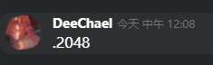
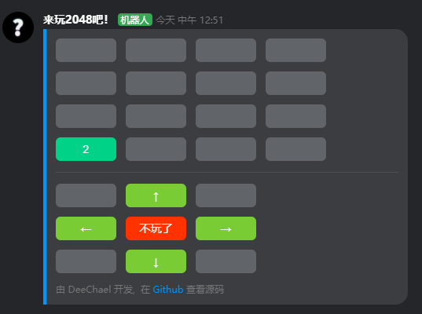
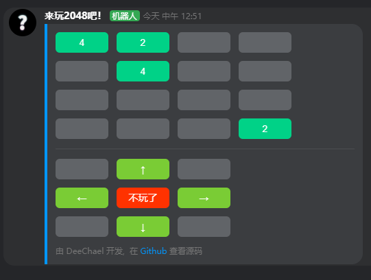
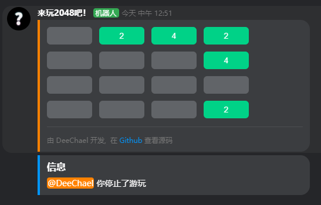

<h1 align="center">Let's Play 2048!</h1>

---
<h3 align="center">
  English | <a href="./README_CN.md">简体中文</a>
</h3>

## | Introduction
Let's Play 2048 is a KOOK (Original Kaiheila) bot for those who want to play 2048 in the KOOK server\
[@Aewait](https://github.com/Aewait) came up with the idea, and I developed the bot

## | How to use
### 1.Invite this bot to your server
[Click here to invite the bot](https://www.kookapp.cn/app/oauth2/authorize?id=12461&permissions=948736&client_id=5v1cdPtL4K5A-1tp&redirect_uri=&scope=bot)
### 2.Type the command

### 3.Then the bot will send a card message

### 4.Click the button below the divider to move

### 5.The game will end if there is a 2048, or the field is filled and there are numbers that can be merged. You can also stop the game by clicking the center button
